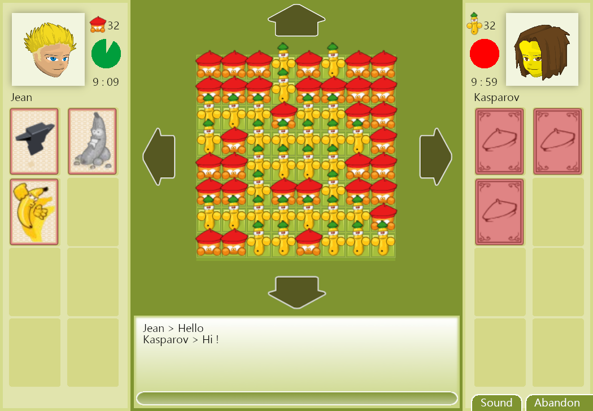

# Frutibandas

<p align=center style="font-size:150%;">
Bringing the game Frutibandas back to life.<br><br>

[https://bicyclette.itch.io/frutibandas](https://bicyclette.itch.io/frutibandas)
<br><br>


<br><br>

</p>

## Getting started

### Dependencies

- [Conan](https://conan.io/)
- [Cmake](https://cmake.org/)

## Build

```
conan install . -s build_type=Release --build missing --install-folder=build
cmake -B build -S .
cmake --build build --config Release
```

## Credit
<p align=center>
The original game was made by the Motion Twin.<br><br>
<a href="https://motion-twin.com/fr/">

</a>
</p>
