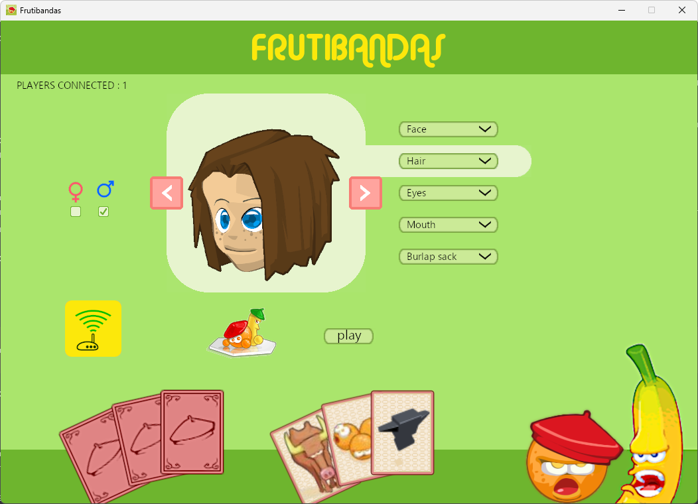
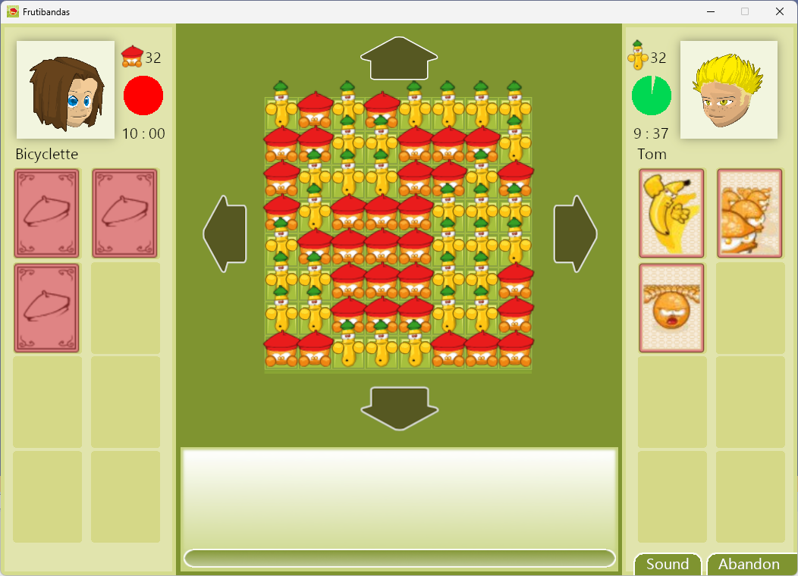

# Frutibandas

<p align=center style="font-size:150%;">
Bringing the game Frutibandas back to life.<br>

<p align=center>
<a href="https://bicyclette.itch.io/frutibandas">bicyclette.itch.io/frutibandas</a>
</p>



<br><br>

</p>

## Getting started

### Dependencies

- [VCPKG](https://github.com/microsoft/vcpkg)
- [Cmake](https://cmake.org/)

## Build

```
./vcpkg install assimp bullet3 enet freetype glew libsndfile sdl2 openal-soft
mkdir build
cd build
cmake ..
cmake --build build --config Release
```

## Credit
<p align=center>
The original game was made by the Motion Twin.<br><br>
<a href="https://motion-twin.com/fr/">

</a>
</p>
